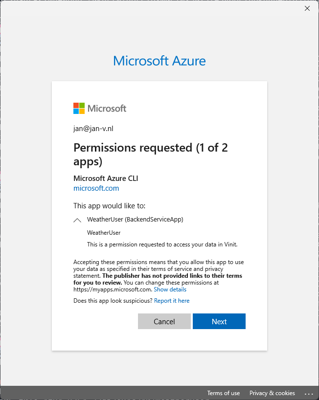
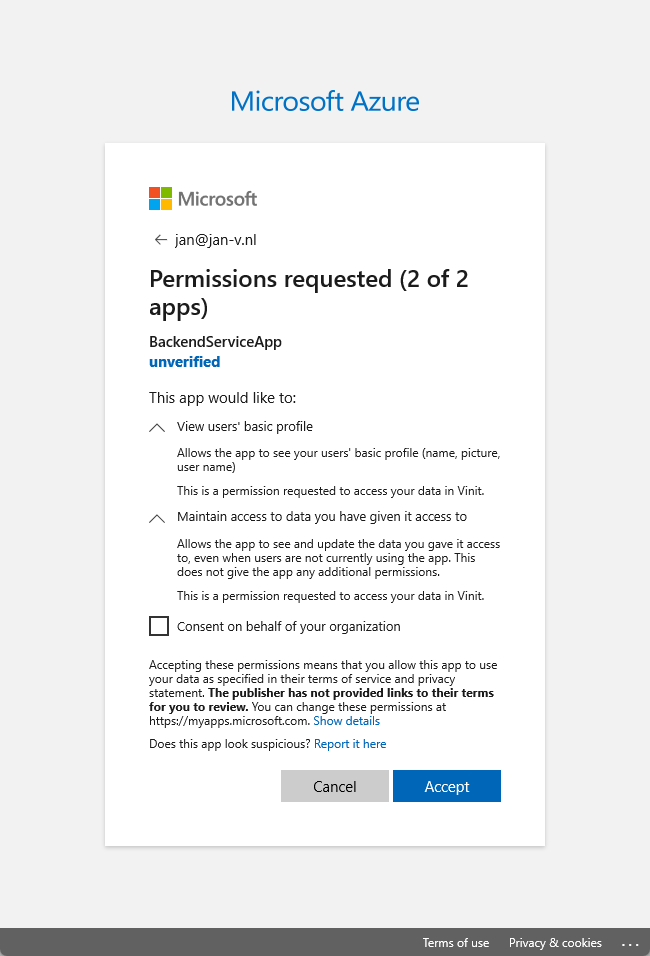

# Sample project for on-behalf-of flow flow

This repository is used as a sample to create the OAuth2.0 On-Behalf-Of flow using two different .NET Core application and Entra ID.  
The flow and detals are descibed in the [MS Learn pages regarding this topic](https://learn.microsoft.com/en-us/entra/identity-platform/v2-oauth2-on-behalf-of-flow).

## Set up

This solution contains multiple projects:

* BackendService  
  This service has authorization in place for all endpoints.
* IntegratingService
  This service also has authorization in place, but also needs to interact with the `BackendService` using the OAuth2.0 OBO-flow to retrieve data for the user.

## Sample usage

```http
GET http://localhost:8080/get-my-data
```


## Errors seen

### Get a token for a specific scope

When trying to get a token with a scope defined for the first time, you can an error.

```azcli
 az account get-access-token --resource=api://afad1932-49c8-4e3c-a3a1-cf9543c84d9e --scope=api://8ebbea06-f01e-4f94-8254-32da2e94c240/WeatherUser --query accessToken --output tsv
(pii). Status: Response_Status.Status_InteractionRequired, Error code: 3399614476, Tag: 557973645
Please explicitly log in with:
az login --scope api://8ebbea06-f01e-4f94-8254-32da2e94c240/WeatherUser
```

This is because you need to provide Consent for the scope first. When you run the login command with the proper scope, you will be prompted to provide consent.
```azcli
az login --scope api://8ebbea06-f01e-4f94-8254-32da2e94c240/WeatherUser
```

This will open a browser window where you can provide consent for the scope.





This should yield in a token looking similar to the sample below.

```json
{
  "typ": "JWT",
  "alg": "RS256",
  "kid": "H9nj5AOSswMphg1SFx7jaV-lB9w"
}.{
  "aud": "8ebbea06-f01e-4f94-8254-32da2e94c240",
  "iss": "https://login.microsoftonline.com/4b1fa0f3-862b-4951-a3a8-df1c72935c79/v2.0",
  "iat": 1725547137,
  "nbf": 1725547137,
  "exp": 1725551937,
  "aio": "AWQAm/8XAAAAPG9SheyqcZONBaWFrBLTrYCZvTRTV8gRh3Bklxy7HQYw0PDedJgYh0Zj+Fqqk04gy3j8yWrBtG4aR+2ddup99MhkQHmJaqWoK+o/XxYShKdrcc6mZivLzvgRO4QDf/6C",
  "azp": "04b07795-8ddb-461a-bbee-02f9e1bf7b46",
  "azpacr": "0",
  "name": "Jan de Vries",
  "oid": "bf6c3c10-5aad-4cd8-b54c-f9083925e7e3",
  "preferred_username": "jan@jan-v.nl",
  "rh": "0.ATAA86AfSyuGUUmjqN8ccpNceQbqu44e8JRPglQy2i6UwkAwAGo.",
  "roles": [
    "Admin"
  ],
  "scp": "BackendDefault WeatherUser",
  "sub": "MiVyAiU0Q9B7caSpyCvvge63H6Ohve2hED15NmFfx1s",
  "tid": "4b1fa0f3-862b-4951-a3a8-df1c72935c79",
  "uti": "Ats0cwbTrk6Dfs2WbHwNAA",
  "ver": "2.0"
}.[Signature]
```

After providing consent, you can login in the Azure CLI with the regular flow again. Creating tokens should now work, even with the scope.

```azcli
az login --tenant 4b1fa0f3-862b-4951-a3a8-df1c72935c79
```