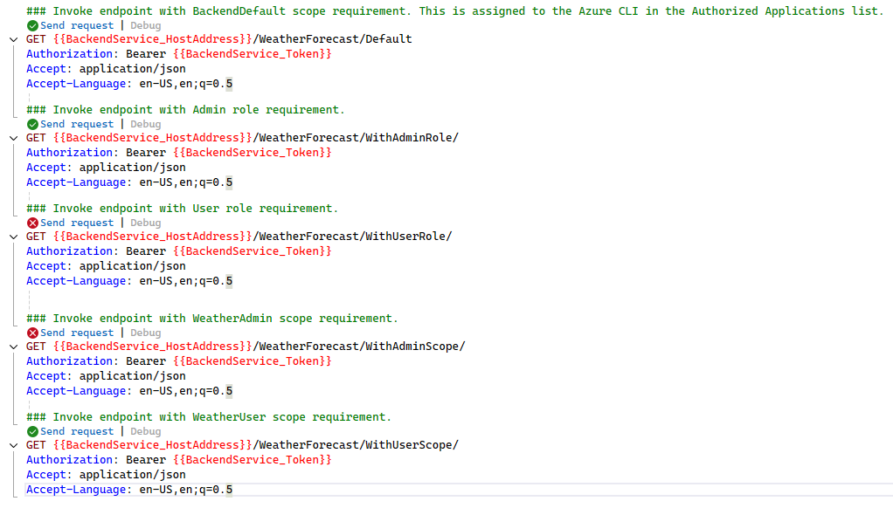

# Sample project for on-behalf-of flow flow

This repository is used as a sample to create the OAuth2.0 On-Behalf-Of flow using two different .NET Core application and Entra ID.  
The flow and detals are descibed in the [MS Learn pages regarding this topic](https://learn.microsoft.com/en-us/entra/identity-platform/v2-oauth2-on-behalf-of-flow).

## Set up

This solution contains multiple projects:

* BackendService  
  This service has authorization in place for all endpoints.
* IntegratingService
  This service also has authorization in place, but also needs to interact with the `BackendService` using the OAuth2.0 OBO-flow to retrieve data for the user.

The [Bicep file](./deployment/main.bicep) will take care of deploying all resources in Azure. This is automated with the GitHub Action responsible for this.

Do make sure to enable the necessary secrets in Azure Key Vault and fill them with the correct details. 

> [!NOTE]
> If you run into errors about a Managed Identity not being able to access Azure Key Vault, please refer to the [error section below](#key-vault-references-not-working).

### Assigning Application Roles

To assign application roles to a user, group, or service principal, you can use the Azure CLI. Below is an example of how to assign a role to a user-managed identity.

```azcli
# The object id from the User Managed Identity in need of the role assignment.
$managedIdentityObjectId = "90adeed6-5fd2-4a3a-bc40-5495870d66a4"
# The enterprise application object id of the that you want the identity assigned a role to.
$enterpriseApplicationObjectId = "a38fce62-6da2-45b0-8204-b7bcf7cc4613"
# The role id that you want to assign to the identity.
$appRoleId = "93ef304e-c5f2-4b9a-b93c-64b5daf61afb"
# The identity type for the identity. This should always be ServicePrincipal, when not assigning Users or Groups.
$IdentityType = "ServicePrincipal"

Write-Verbose -Message "Assigning role $($appRoleId) to identity $($managedIdentityObjectId) for service principal $($enterpriseApplicationObjectId)."
az rest `
    --method post `
    --uri https://graph.microsoft.com/beta/servicePrincipals/$($enterpriseApplicationObjectId)/appRoleAssignments `
    --headers "{'content-type': 'application/json'}" `
    --body "{'appRoleId': '$($appRoleId)', 'principalId': '$($managedIdentityObjectId)', 'principalType': '$($IdentityType)', 'resourceId': '$($enterpriseApplicationObjectId)'}"

Write-Output "Assigned role $($appRoleId) to identity $($managedIdentityObjectId) for service principal $($enterpriseApplicationObjectId)."
```

## Sample usage

Please refer the the different HTTP files included in this repository to see how the endpoints can be invoked.

* [IntegratingService](./src/auth-with-obo/IntegratingService/IntegratingService.http)
* [BackendService](./src/auth-with-obo/BackendService/BackendService.http)

## Tests

While implementing the solution, continuous testing is in place. Results are shared in this section.

### BackendService

#### Admin role and WeatherUser scope

With the contents in the bearer token, we see functionality (authorization) is working as expected.

```json
{
  "typ": "JWT",
  "alg": "RS256",
  "kid": "H9nj5AOSswMphg1SFx7jaV-lB9w"
}.{
  "aud": "8ebbea06-f01e-4f94-8254-32da2e94c240",
  "iss": "https://login.microsoftonline.com/4b1fa0f3-862b-4951-a3a8-df1c72935c79/v2.0",
  "iat": 1725622279,
  "nbf": 1725622279,
  "exp": 1725627509,
  "aio": "AXQAi/8XAAAA/bEntSNEIXjGJrqs9nbb6HjiuPAp/p+FYSIJDgUShpt52nHCvU3opUwMe2MjvRjGK970a3eWWMxQPcK6merohVFPhbFsu72mGRouKE1+QGIWkxW5xjivCnJTkENx2HSoEJh9NsQI+HpJaTpN3/65Tg==",
  "azp": "04b07795-8ddb-461a-bbee-02f9e1bf7b46",
  "azpacr": "0",
  "name": "Jan de Vries",
  "oid": "bf6c3c10-5aad-4cd8-b54c-f9083925e7e3",
  "preferred_username": "jan@jan-v.nl",
  "rh": "0.ATAA86AfSyuGUUmjqN8ccpNceQbqu44e8JRPglQy2i6UwkAwAGo.",
  "roles": [
    "Admin"
  ],
  "scp": "BackendDefault WeatherUser",
  "sub": "MiVyAiU0Q9B7caSpyCvvge63H6Ohve2hED15NmFfx1s",
  "tid": "4b1fa0f3-862b-4951-a3a8-df1c72935c79",
  "uti": "zqIiAA_oSEC3T1wZvLoKAA",
  "ver": "2.0"
}.[Signature]
```



### IntegratingService

The goal for this solution is to have the on-behalf-of flow working from the `IntegratingService` towards the `BackendService`.

The HTTP tests that go along with this are successful at this moment.


The details of the token towards the `IntegratingService` is the following:

```json


jwt.ms

Enter token below (it never leaves your browser):
eyJ0eXAiOiJKV1QiLCJhbGciOiJSUzI1NiIsIng1dCI6Ikg5bmo1QU9Tc3dNcGhnMVNGeDdqYVYtbEI5dyIsImtpZCI6Ikg5bmo1QU9Tc3dNcGhnMVNGeDdqYVYtbEI5dyJ9.eyJhdWQiOiJhcGk6Ly9hZmFkMTkzMi00OWM4LTRlM2MtYTNhMS1jZjk1NDNjODRkOWUiLCJpc3MiOiJodHRwczovL3N0cy53aW5kb3dzLm5ldC80YjFmYTBmMy04NjJiLTQ5NTEtYTNhOC1kZjFjNzI5MzVjNzkvIiwiaWF0IjoxNzI3MTg3OTk3LCJuYmYiOjE3MjcxODc5OTcsImV4cCI6MTcyNzE5Mjk1NSwiYWNyIjoiMSIsImFpbyI6IkFWUUFxLzhYQUFBQVJEVGFkVHFiWTBkOU4zMHRrM2dzVVVSc29VdmxVeHRkbDRvdzdxRS94MWE5TUVVV2RnbndXV2J0L3BNSEJibVVuWlh4aDh4Mm9BRGM3MWdyRmdzOUtwbHVFc2JGTk9QYVJWM2pnNHFyMGJVPSIsImFtciI6WyJwd2QiLCJyc2EiLCJtZmEiXSwiYXBwaWQiOiIwNGIwNzc5NS04ZGRiLTQ2MWEtYmJlZS0wMmY5ZTFiZjdiNDYiLCJhcHBpZGFjciI6IjAiLCJkZXZpY2VpZCI6ImFkYzJmZGU1LWUyYWQtNGJiNS1hNDMyLTRiMzQyZWFlMWU1ZCIsImZhbWlseV9uYW1lIjoiZGUgVnJpZXMiLCJnaXZlbl9uYW1lIjoiSmFuIiwiaXBhZGRyIjoiODQuODQuMTcwLjEzNiIsIm5hbWUiOiJKYW4gZGUgVnJpZXMiLCJvaWQiOiJiZjZjM2MxMC01YWFkLTRjZDgtYjU0Yy1mOTA4MzkyNWU3ZTMiLCJwd2RfdXJsIjoiaHR0cHM6Ly9wb3J0YWwubWljcm9zb2Z0b25saW5lLmNvbS9DaGFuZ2VQYXNzd29yZC5hc3B4IiwicmgiOiIwLkFUQUE4NkFmU3l1R1VVbWpxTjhjY3BOY2VUSVpyYV9JU1R4T282SFBsVVBJVFo0d0FHby4iLCJzY3AiOiJDdXN0b21EZWZhdWx0Iiwic3ViIjoiZWFBaW4tTjVZMUIwaFVZSWRqMnZOQ1hSc1l4TG1yMGNhSHhOdU5SUEx4USIsInRpZCI6IjRiMWZhMGYzLTg2MmItNDk1MS1hM2E4LWRmMWM3MjkzNWM3OSIsInVuaXF1ZV9uYW1lIjoiamFuQGphbi12Lm5sIiwidXBuIjoiamFuQGphbi12Lm5sIiwidXRpIjoiWnp4Tk9TZkNlMC15bE9rblI5cFhBQSIsInZlciI6IjEuMCJ9.SL-0jzBdwPKJld4m4RLNCwwhi2qDs-0VMx16VgYJOGezq95M7O6szaDbMDncyXlVs0xKFyqDErc_TcScBlRajD-tysHkEXS8q942p8kyjGOfPCzBcUEymtxFmkt0KhR9QisIwpslt903WMhY5BJYYDbZwPS7mmDad2zl7vN1PPgqPNwqgWUciDA-Jh1aMi2k7QesS4kVzYAuMM-E5zmYP66V9pIIulQGBlCqH2pJPC0WoTFSz0AiutjPtFRHws8hgYTtgX2sY_LCiQav9e0qxt6NtHdTWF0vq6C8W-rgaM6XDLHpKW1bDKBSDiX5syiRY-GEQtjEgV4ILK7TFyVJhg
This token was issued by Azure Active Directory.
Decoded Token
Claims
{
  "typ": "JWT",
  "alg": "RS256",
  "x5t": "H9nj5AOSswMphg1SFx7jaV-lB9w",
  "kid": "H9nj5AOSswMphg1SFx7jaV-lB9w"
}.{
  "aud": "api://afad1932-49c8-4e3c-a3a1-cf9543c84d9e",
  "iss": "https://sts.windows.net/4b1fa0f3-862b-4951-a3a8-df1c72935c79/",
  "iat": 1727187997,
  "nbf": 1727187997,
  "exp": 1727192955,
  "acr": "1",
  "aio": "AVQAq/8XAAAARDTadTqbY0d9N30tk3gsUURsoUvlUxtdl4ow7qE/x1a9MEUWdgnwWWbt/pMHBbmUnZXxh8x2oADc71grFgs9KpluEsbFNOPaRV3jg4qr0bU=",
  "amr": [
    "pwd",
    "rsa",
    "mfa"
  ],
  "appid": "04b07795-8ddb-461a-bbee-02f9e1bf7b46",
  "appidacr": "0",
  "deviceid": "adc2fde5-e2ad-4bb5-a432-4b342eae1e5d",
  "family_name": "de Vries",
  "given_name": "Jan",
  "ipaddr": "84.84.170.136",
  "name": "Jan de Vries",
  "oid": "bf6c3c10-5aad-4cd8-b54c-f9083925e7e3",
  "pwd_url": "https://portal.microsoftonline.com/ChangePassword.aspx",
  "rh": "0.ATAA86AfSyuGUUmjqN8ccpNceTIZra_ISTxOo6HPlUPITZ4wAGo.",
  "scp": "CustomDefault",
  "sub": "eaAin-N5Y1B0hUYIdj2vNCXRsYxLmr0caHxNuNRPLxQ",
  "tid": "4b1fa0f3-862b-4951-a3a8-df1c72935c79",
  "unique_name": "jan@jan-v.nl",
  "upn": "jan@jan-v.nl",
  "uti": "ZzxNOSfCe0-ylOknR9pXAA",
  "ver": "1.0"
}.[Signature]
```

The token sent towards the backend is the following:

```json
{
  "typ": "JWT",
  "alg": "RS256",
  "kid": "H9nj5AOSswMphg1SFx7jaV-lB9w"
}.{
  "aud": "8ebbea06-f01e-4f94-8254-32da2e94c240",
  "iss": "https://login.microsoftonline.com/4b1fa0f3-862b-4951-a3a8-df1c72935c79/v2.0",
  "iat": 1727188097,
  "nbf": 1727188097,
  "exp": 1727192953,
  "aio": "AXQAi/8XAAAA1+ns3RW8+ljrfjo6G6WtVSjvbd0xtDPm/eGhHStWH7ZagBwj2nuw25+9CmO8iLDzcMDryih+HK/A2YoVQxtjiDNKCxcb0uQRX6Fp4c4W7nxWKb9I6ybT6JcDN1fecwx3rQ9kAvtUvDGeqLaJz6JY8g==",
  "azp": "afad1932-49c8-4e3c-a3a1-cf9543c84d9e",
  "azpacr": "1",
  "name": "Jan de Vries",
  "oid": "bf6c3c10-5aad-4cd8-b54c-f9083925e7e3",
  "preferred_username": "jan@jan-v.nl",
  "rh": "0.ATAA86AfSyuGUUmjqN8ccpNceQbqu44e8JRPglQy2i6UwkAwAGo.",
  "roles": [
    "Admin"
  ],
  "scp": "user_impersonation WeatherAdmin WeatherUser",
  "sub": "MiVyAiU0Q9B7caSpyCvvge63H6Ohve2hED15NmFfx1s",
  "tid": "4b1fa0f3-862b-4951-a3a8-df1c72935c79",
  "uti": "xhunNTrb2US8oEV8a05HAA",
  "ver": "2.0"
}.[Signature]
```

> [!NOTE]
> The scope property has all the scopes that are assigned to the `IntegratingService` App Registration.
> 
> This needs to be fixed!

## Errors seen

### Get a token for a specific scope

When trying to get a token with a scope defined for the first time, you can an error.

```azcli
 az account get-access-token --resource=api://afad1932-49c8-4e3c-a3a1-cf9543c84d9e --scope=api://8ebbea06-f01e-4f94-8254-32da2e94c240/WeatherUser --query accessToken --output tsv
(pii). Status: Response_Status.Status_InteractionRequired, Error code: 3399614476, Tag: 557973645
Please explicitly log in with:
az login --scope api://8ebbea06-f01e-4f94-8254-32da2e94c240/WeatherUser
```

This is because you need to provide Consent for the scope first. When you run the login command with the proper scope, you will be prompted to provide consent.

```azcli
az login --scope api://8ebbea06-f01e-4f94-8254-32da2e94c240/WeatherUser
```

This will open a browser window where you can provide consent for the scope.


This should yield in a token looking similar to the sample below.

```json
{
  "typ": "JWT",
  "alg": "RS256",
  "kid": "H9nj5AOSswMphg1SFx7jaV-lB9w"
}.{
  "aud": "8ebbea06-f01e-4f94-8254-32da2e94c240",
  "iss": "https://login.microsoftonline.com/4b1fa0f3-862b-4951-a3a8-df1c72935c79/v2.0",
  "iat": 1725547137,
  "nbf": 1725547137,
  "exp": 1725551937,
  "aio": "AWQAm/8XAAAAPG9SheyqcZONBaWFrBLTrYCZvTRTV8gRh3Bklxy7HQYw0PDedJgYh0Zj+Fqqk04gy3j8yWrBtG4aR+2ddup99MhkQHmJaqWoK+o/XxYShKdrcc6mZivLzvgRO4QDf/6C",
  "azp": "04b07795-8ddb-461a-bbee-02f9e1bf7b46",
  "azpacr": "0",
  "name": "Jan de Vries",
  "oid": "bf6c3c10-5aad-4cd8-b54c-f9083925e7e3",
  "preferred_username": "jan@jan-v.nl",
  "rh": "0.ATAA86AfSyuGUUmjqN8ccpNceQbqu44e8JRPglQy2i6UwkAwAGo.",
  "roles": [
    "Admin"
  ],
  "scp": "BackendDefault WeatherUser",
  "sub": "MiVyAiU0Q9B7caSpyCvvge63H6Ohve2hED15NmFfx1s",
  "tid": "4b1fa0f3-862b-4951-a3a8-df1c72935c79",
  "uti": "Ats0cwbTrk6Dfs2WbHwNAA",
  "ver": "2.0"
}.[Signature]
```

After providing consent, you can login in the Azure CLI with the regular flow again. Creating tokens should now work, even with the scope.

```azcli
az login --tenant 4b1fa0f3-862b-4951-a3a8-df1c72935c79
```

### Key Vault references not working

If you get the following error when using Key Vault references, you need to do an additional step.

> Status: MSINotEnabled
> Error details: Reference was not able to be resolved because site Managed Identity not enabled.

According to the [MS Learn pages on this topic](https://learn.microsoft.com/en-us/azure/app-service/app-service-key-vault-references?tabs=azure-cli#access-vaults-with-a-user-assigned-identity), you need to invoke the following commands:

```powershell
$resourceGroup = "auth-with-obo"
$backendIdentityName = "backendServiceApp-identity"
$backendAppName = "backendServiceApp"
$backendIdentityResourceId =$(az identity show --resource-group $resourceGroup --name $backendIdentityName --query id -o tsv)
az webapp update --resource-group $resourceGroup --name $backendAppName --set keyVaultReferenceIdentity=$backendIdentityResourceId

$integratingIdentityName = "integratingServiceApp-identity"
$integratingAppName = "integratingServiceApp"
$integratingIdentityResourceId =$(az identity show --resource-group $resourceGroup --name $integratingIdentityName --query id -o tsv)
az webapp update --resource-group $resourceGroup --name $integratingAppName --set keyVaultReferenceIdentity=$integratingIdentityResourceId
```

The App Service now is using the user-managed identity to connect with the Azure Key Vault. By default the System Managed Identity is used.
